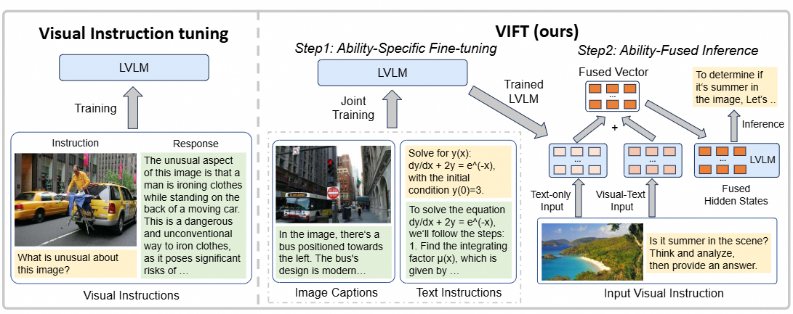
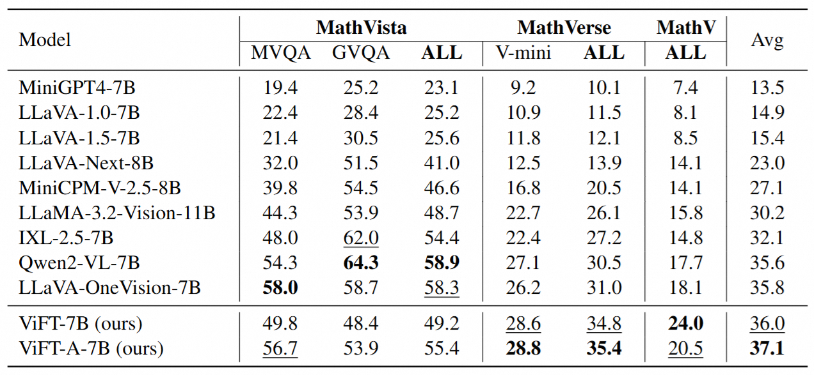

# ViFT: Do we Really Need Visual Instructions? Towards Visual Instruction-Free Fine-tuning for Large Vision-Language Models

## 😀 Overview

+ ViFT is the first instruction-free fine-tuning method with comparable performance to SOTA LVLMs.

+ We specially designed the training and inference methods for disentangling and combining natural language task-solving and visual perception abilities, to efficiently improve the multimodal capabilities of LVLMs.

+ Our ViFT is a low-cost approach for scaling data to improve LVLMs. Experimental results demonstrate the effectiveness of our approach on several benchmarks.

  

## 🚀 Quick Start

### Requirements

- python
- transformers
- pytorch
- accelerate
- openai==0.28.0

### Data Preparation and Training Setting

Coming soon

### Evaluation

Coming soon

## 🌟 Results

  

## Related Projects

- [Visual Instruction Tuning](https://github.com/haotian-liu/LLaVA)
- [Bunny: A family of lightweight multimodal models](https://github.com/BAAI-DCAI/Bunny)
- [Steer LLM outputs with activation engineering](https://github.com/Mihaiii/llm_steer)

